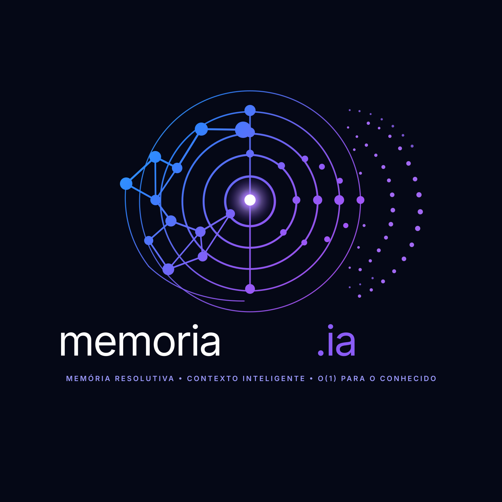

<p align="center">
  
</p>

<p align="center"><strong>Resolutive Memory for persistent state, relations, trajectories and AI context.</strong></p>

# memoria.ia

Experimental implementation of **Resolutive Memory**, a local-first memory architecture built around persistent state, reusable knowledge nodes, multiple trajectories, provenance, online lifecycle dynamics and conservative resolution.

## v1.0 Release Candidate 3

Current corrective freeze candidate: **v1.0.0-rc3** (`1.0.0rc3` package version).

**Archival DOI:** 10.5281/zenodo.22253566

RC3 supersedes the published `v1.0.0-rc2` because RC2 was created with a release-tag alignment error. RC3 does **not** add a new functional capability over the validated frozen runtime; it corrects the publication lineage so the tag, package version and archival metadata point to the intended codebase.

The runtime architecture remains:

```text
application / OFF.IA / agent
          ↓
      Memoria.ia
          ↓
   Resolutive-DB / BDR
```

Memoria.ia owns memory semantics, state, relations, provenance, trajectories, retrieval and bounded inference. BDR owns durable persistence. LLMs remain optional consumers and do not become the authoritative memory store.

The frozen v1.0 RC runtime includes:

- organization and namespace isolation;
- FastAPI `/api/v1` PC/server product interface;
- persistent restart/recovery and integrity-checked backup/restore;
- native production runtime and Android arm64-v8a ABI;
- BDR-backed durable native memory state;
- semantic, episodic, temporal and relation kernels;
- provenance and lineage safeguards;
- Retrieval v2 with deterministic normalization, ambiguity checks and conceptual-coverage gates;
- separated evidence dimensions: source authority, retrieval relevance, semantic confidence and freshness;
- automatic episodic capture for identified sessions;
- relation semantic validation before graph promotion;
- `assistant_generated` content blocked from automatic factual relation promotion by default;
- explicit resolution modes: `DIRECT`, `INFERRED`, `UNRESOLVED`, `CONFLICT`;
- bounded deterministic 2-hop Resolutive Inference with proof memory IDs and path confidence;
- strict typed transitive relations: `esta_em`, `parte_de`, `subclasse_de`;
- generic `is` / `é` remains non-transitive;
- inferred conclusions are calculated but are not persisted as new facts.

## Corrective publication status

RC3 archival DOI: **10.5281/zenodo.22253566**.

The RC2 archival DOI is **10.5281/zenodo.22244038**. It remains historical metadata for RC2 and is not reused for RC3.

## Validation status

The functional codebase underlying RC3 is the validated RC2 freeze lineage. RC3 changes release/version/publication metadata only. The frozen functional lineage passed the required gates including Retrieval v2 adapter/matrix, relation validation, typed relation extraction, external relevance, evidence metrics/runtime, automatic episodes, durable restart behavior and Android ARM64 ABI.

## Conservative resolution behavior

Memoria.ia intentionally treats uncertainty as a valid outcome:

```text
DIRECT
INFERRED
UNRESOLVED
CONFLICT
```

Direct persisted evidence has precedence. Inference is attempted only after a direct miss and only with explicit structured subject/predicate input. Unsupported relations, insufficient conceptual coverage or equally strong contradictory inference paths fail closed instead of fabricating certainty.

Retrieval and inference remain separate layers: similarity retrieves existing evidence; only explicitly typed and allowlisted transitive relations may produce a new inferred conclusion.

## Security status

**v1.0.0-rc3 is not represented as production-security certified.**

The repository includes authentication boundaries, application isolation, integrity-checked backup/restore and negative security tests, but no independent production security audit is claimed.

## Previous releases

- **v1.0.0-rc2** — superseded by RC3 due to release-tag alignment error; DOI **10.5281/zenodo.22244038**.
- **v1.0.0-rc1** — first v1 publication candidate; DOI **10.5281/zenodo.22170165**.
- **v0.99.0-alpha.1** — first PC/server product alpha.
- **v0.95.1** — archived research metadata patch.
- **v0.95.0** — research release.

## Install and test

```bash
python -m pip install -e '.[product,test]'
python -m pytest -q
```

Container deployment is defined by `Dockerfile`, `compose.yaml` and `.env.example`.

## Research and claims status

Memoria.ia remains an experimental architecture. v1.0.0-rc3 is a reproducible corrective software release candidate, not a claim of artificial general intelligence, biological equivalence or replacement of general-purpose LLMs.

Important limitations include deterministic Retrieval v2 not claiming universal language understanding, Resolutive Inference being bounded to explicit typed 2-hop transitive relations, distributed/federated operation remaining outside the stable local runtime boundary, and no independent production security certification.

See `KNOWN_LIMITATIONS.md` for the complete release boundary.

## License

Source is publicly visible under the **Resolutive Research and Non-Commercial License (RRNCL) v1.0**. Academic, educational and permitted non-commercial research use is allowed under its terms. Commercial use requires separate authorization. Because commercial use is restricted, this project should not be represented as OSI-approved Open Source.

## Release notes

See `RELEASE_NOTES_v1.0.0-rc3.md` for the corrective release scope and publication discipline.
